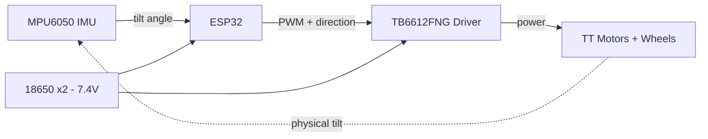

# Tobble 🤖

> **Tobble** - a self-balancing two-wheeled robot (it tips, it wobbles, it stays up).
> An ESP32-powered inverted-pendulum robot that keeps itself upright on two wheels using an IMU and a real-time PID control loop.


> 🚧 **Work in progress** - this is an active build. Currently developing the control loop in simulation while hardware ships. Follow the [Build Log](docs/BUILD_LOG.md) for progress.

<!-- TODO: Replace this line with a demo GIF once you have the bot balancing.
     A 3-5 second looping GIF of it standing up is the single most important
     thing in this README. Record on your phone, convert at ezgif.com, drop
     the file in /media and link it here: -->
<!--  -->

---

## Overview

This is my first hardware robotics project, built during my MSc in AI & Robotics
to move from simulation-only work into real embedded control.

A self-balancing robot is an **inverted pendulum** - left alone it falls over. To
stay upright it runs a continuous **sense → think → act** loop hundreds of times
per second:

1. **Sense** - read the body's tilt angle from an MPU6050 IMU
2. **Think** - a PID controller computes the motor correction needed
3. **Act** - drive the wheels to catch the fall and return to vertical

The goal wasn't just to make it balance, but to *understand* every layer:
sensor fusion, closed-loop control, and the electronics underneath.

<!-- TODO: In 1-2 sentences, add your personal angle - why you chose this,
     what you wanted to learn. Reviewers read this first. -->

---

## How It Works

### Sensor fusion
The MPU6050 gives two noisy estimates of tilt: the **accelerometer** (accurate
long-term but jittery) and the **gyroscope** (smooth short-term but drifts). I
fuse them with a **complementary filter** to get one clean, stable angle:

```
angle = α * (angle + gyro_rate * dt) + (1 - α) * accel_angle
```

<!-- TODO: state the α value you settled on and why, once tuned. -->

### Control loop
A **PID controller** takes the tilt error (target 0° = upright) and outputs a
motor command. Tuning the three gains (Kp, Ki, Kd) by hand was the core
learning experience of the project.

<!-- TODO: record your final Kp / Ki / Kd values and a note on how each
     one behaved during tuning. This section is where you demonstrate real
     understanding - write it in your own words. -->

### Architecture
<!-- TODO: add a simple block diagram. You can draw it in draw.io / Excalidraw
     and export a PNG into /media, or use a Mermaid diagram like below. -->



---

## Hardware

| Component | Part | Role |
|---|---|---|
| Microcontroller | ESP32-32D DevKit V1 (+ GPIO expansion board) | The brain; runs the control loop |
| IMU | GY-521 MPU6050 (6-axis accel + gyro) | Measures tilt angle |
| Motor driver | TB6612FNG (dual channel) | Lets the ESP32 drive the motors |
| Motors + wheels | 2× TT gear motors + wheels (from 2WD chassis kit) | Actuation |
| Chassis | 2-layer acrylic 2WD kit (incl. encoders + ultrasonic sensor) | Body |
| Power | 2× 18650 Li-ion cells (2600mAh) in series → 7.4V | Runs motors + logic |
| Battery holder | 2-slot 18650 box with switch | Holds/powers from cells |
| Charger | 18650 Li-ion charger | Recharges cells |
| Prototyping | 830-point breadboard, Dupont jumper wires | Wiring |
| Cable | USB-A to USB-C data cable | Programming the ESP32 |

---

## Wiring

<!-- TODO: add a wiring diagram (Fritzing, Wokwi screenshot, or a hand-drawn
     photo is fine) into /media and link it. Also fill in the pin table below
     with the actual GPIO pins you used. -->

| From | To | Notes |
|---|---|---|
| MPU6050 VCC | ESP32 3V3 | |
| MPU6050 GND | ESP32 GND | |
| MPU6050 SDA | ESP32 GPIO __ | I2C data |
| MPU6050 SCL | ESP32 GPIO __ | I2C clock |
| TB6612 PWMA / PWMB | ESP32 GPIO __ / __ | motor speed |
| TB6612 AIN1/2, BIN1/2 | ESP32 GPIO __ | motor direction |
| TB6612 VM | Battery + (7.4V) | motor power |
| TB6612 VCC | ESP32 3V3 | logic power |
| Common ground | tie ALL grounds together | **critical** |

> ⚠️ **Power note:** motors are powered from the battery (VM), *not* from the
> ESP32's pins. All grounds must be common. Getting this wrong is the most
> common way to brown out or damage the board.

---

## Software

### Requirements
- [Arduino IDE](https://www.arduino.cc/en/software) (or PlatformIO)
- ESP32 board support installed via Boards Manager
- Libraries: <!-- TODO: list the exact libraries you used, e.g. an MPU6050 lib -->

### Setup
```bash
# 1. Clone the repo
git clone https://github.com/<your-username>/self-balancing-bot.git

# 2. Open src/ in the Arduino IDE
# 3. Select board: "ESP32 Dev Module"
# 4. Select the correct COM port
# 5. Upload
```

<!-- TODO: expand once your code is written. -->

### Simulation
Before the hardware arrived, I prototyped the control loop in
[Wokwi](https://wokwi.com) (browser-based ESP32 simulator). See `/simulation`.

<!-- TODO: link your Wokwi project once you make it. -->

---

## Build Log

I keep a running, honest log of what I built, what broke, and how I fixed it -
documenting my problem-solving, not just the final result.

📓 **[Read the full Build Log →](docs/BUILD_LOG.md)**

---

## Results

<!-- TODO: fill in once working. Include:
     - the demo GIF/video
     - how long it can balance
     - how it handles a nudge / disturbance
     - a plot of tilt-angle-over-time if you log serial data (great touch) -->

---

## Future Work

Planned extensions that build on this foundation:

- [ ] **Remote control** - drive it over WiFi/Bluetooth while it stays upright
- [ ] **Obstacle avoidance** - use the onboard ultrasonic sensor to stop at walls
- [ ] **Position hold** - use the wheel encoders to hold a spot / return to it
- [ ] **Learned control (RL)** - replace hand-tuned PID with a policy trained in
      simulation (PyBullet / MuJoCo) and transferred to hardware (sim-to-real).
      This is the direction I'm most interested in as an AI student.

---

## Repository Structure

```
self-balancing-bot/
├── README.md
├── src/                  # Arduino/ESP32 firmware
├── simulation/           # Wokwi files / sim experiments
├── media/                # photos, GIFs, diagrams, plots
├── docs/                 # extended notes, tuning logs, datasheets
└── LICENSE
```

---

## Acknowledgements

Built as a self-directed learning project. I used an AI assistant as a
guide - for explaining concepts (sensor fusion, PID control), reviewing
code, and sanity-checking my hardware choices. All design decisions are my
own, and every concept in this repo is documented in my own words in the
[Build Log](docs/BUILD_LOG.md) to reflect my actual understanding.

## License

Released under the MIT License - see [LICENSE](LICENSE).
