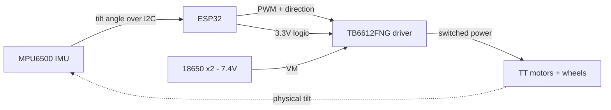

# Tobble 🤖

> **Tobble** — a self-balancing two-wheeled robot (it tips, it wobbles, and — for now — it still falls).
> An ESP32-powered inverted-pendulum robot that reads its tilt from an IMU and runs a real-time PID control loop to drive its wheels back under the fall.


> **Project status: archived, complete as far as it goes.** The full
> **sense → think → act** control system is built, assembled, and **verified
> working on the physical robot** — tilting the body produces the correct motor
> command, direction, and wheel response. I ran out of project time before
> `Kp`/`Kd` tuning converged on sustained self-balancing, and I'm not continuing
> this build. See [Results](#results) for the honest final account.


📹 **[Watch the demo clip](media/demo.mp4)** — a slight manual tilt on the assembled
robot; not a balancing run, just the closed loop visibly reacting (wheels
responding to the tilt in the correct direction)

---

## Overview

My first hardware robotics project, built during my MSc in AI & Robotics to move
from simulation-only work into real embedded control.

I chose a self-balancing robot because it's the classic proving ground for
real-time control — an **inverted pendulum** that falls over if left alone and
only stays up if a **sense → think → act** loop runs fast and correctly,
hundreds of times a second:

1. **Sense** — read the body's tilt angle from an IMU (accelerometer + gyroscope)
2. **Think** — a PID controller computes the motor correction needed
3. **Act** — drive both wheels to catch the fall and return toward vertical

Coming from simulation-only AI work, I wanted to feel where clean theory meets
messy hardware. The honest lesson of this project: **almost all of the
difficulty lives in the hardware**, not the algorithm — the
[Build Log](docs/BUILD_LOG.md) documents that struggle, in my own words, dated
and in order.

---

## How It Works

### Sensor fusion (Sense)
The IMU gives two noisy estimates of tilt: the **accelerometer** (accurate
long-term but jittery, and it can't distinguish gravity from the robot's own
acceleration) and the **gyroscope** (smooth short-term but drifts). I fuse them
with a **complementary filter** into one clean angle:

```
angle = α · (angle + gyro_rate · dt) + (1 − α) · accel_angle     // α = 0.98
```

`α = 0.98` trusts the gyro 98% short-term while the accelerometer's 2% slowly
corrects the gyro's drift. On real hardware the gyro visibly *leads* fast motion
and the accelerometer anchors it against drift — measured gyro bias was
~0.9°/s, which would drift the angle ~54°/min uncorrected.

> **A real debugging find — orientation:** the IMU sits *vertically* on the
> standing body, so forward/back tilt shows up on the **X–Z accelerometer plane
> and the Y gyro axis** — not the flat-board axes the first version assumed.
> Upright was reading ~−176° (sitting on the `atan2` ±180° wraparound and
> jumping wildly between readings) until I re-derived it from raw-axis data as
> `atan2(ax, −az)` with a small calibrated offset so upright reads ~0°.

### Control loop — PID (Think)
A **PID controller** turns the tilt error (target = upright) into a signed motor
command:

```
output = Kp·error + Ki·errorSum + Kd·dError        // clamped to the motor range
```

Final gains, left as the last tuning checkpoint: **Kp = 60, Ki = 0, Kd = 0.8**.

- **Kp (proportional)** — pushes back in proportion to how far it's tilted.
  Started at 25; on hardware a small ~3° lean only produced a weak command, so
  the bot kept falling until the lean was already large — then the command
  spiked and overcorrected. Raising Kp to 60 made small leans get a stronger,
  earlier response, the right direction for tuning to continue in.
- **Kd (derivative)** — damps based on *how fast* the angle is changing, to kill
  the wobble/overshoot that Kp alone causes. Left at its initial value; raising
  this alongside Kp was the planned next step.
- **Ki (integral)** — left at **0** on purpose. It removes slow steady lean, but
  needs Kp/Kd stable first and needs anti-windup (the code clamps `errorSum` for
  exactly this reason, ready for whoever turns it on next).

The code also enforces a **±45° fall-cutoff** (motors stop once toppled) and a
**command clamp** (raised from 180 to 220 once testing showed the wheels were
free-spinning, not stalled, at that level).

### Architecture (Act)

```mermaid
flowchart LR
    IMU[MPU6500 IMU] -->|tilt angle over I2C| ESP[ESP32]
    ESP -->|PWM + direction| DRV[TB6612FNG driver]
    DRV -->|switched power| M[TT motors + wheels]
    M -.->|physical tilt| IMU
    BAT[18650 x2 - 7.4V] -->|VM| DRV
    ESP -->|3.3V logic| DRV
```

---

## Hardware

| Component | Part | Role |
|---|---|---|
| Microcontroller | ESP32-32D DevKit V1 | The brain; runs the control loop |
| IMU | GY-521 module — mine reports `WHO_AM_I = 0x70`, i.e. an **MPU6500**, not a true MPU6050 | Measures tilt |
| Motor driver | TB6612FNG (dual channel, "HW-048" clone) | Drives the two motors |
| Motors + wheels | 2× TT gear motors + wheels (2WD kit) | Actuation |
| Chassis | Hand-built body (inverted-pendulum layout: battery high, electronics mid, motors + wheels low) | Body |
| Power | 2× 18650 Li-ion (2600 mAh) in series → 7.4 V | Motor + logic power |
| Prototyping | 830-point breadboard, Dupont jumpers, multimeter | Wiring + debugging |
| Cable | USB-A → USB-C data cable | Programming the ESP32 |


*The hand-built body before electronics went in — inverted-pendulum layout, motors and wheels at the base.*

---

## Wiring


*ESP32 DevKit with the IMU and driver control lines connected.*

| From | To (ESP32 / power) | Notes |
|---|---|---|
| IMU `VCC` | `3V3` | logic power |
| IMU `GND` | `GND` (common) | |
| IMU `SDA` | `GPIO 21` | I2C data |
| IMU `SCL` | `GPIO 22` | I2C clock |
| TB6612 `PWMA` | `GPIO 25` | motor A speed |
| TB6612 `AIN1` / `AIN2` | `GPIO 26` / `GPIO 27` | motor A direction |
| TB6612 `PWMB` | `GPIO 14` | motor B speed |
| TB6612 `BIN1` / `BIN2` | `GPIO 32` / `GPIO 13` | motor B direction |
| TB6612 `AO1/AO2`, `BO1/BO2` | the two motors | outputs |
| TB6612 `VM` | Battery **+** (7.4 V) | **motor power — not from the ESP32** |
| TB6612 `VCC` | `3V3` | driver logic power |
| TB6612 `STBY` | `3V3` | must be HIGH to enable the driver |
| Common ground | **tie ALL grounds together** | ESP32, driver, battery − |

> ⚠️ **Power note:** motors are powered from the battery (`VM`), never from the
> ESP32 pins. All grounds must be common, or the driver can't read the control
> signals. This — plus dead breadboard holes and a channel-B pin mismatch —
> caused most of the debugging time on this project. The
> [Build Log](docs/BUILD_LOG.md) has the full multimeter-driven hunt for each.


---

## Software

### Requirements
- [PlatformIO IDE](https://platformio.org/install/ide?install=vscode) (VS Code extension)
- Silicon Labs [CP210x USB-to-UART driver](https://www.silabs.com/software-and-tools/usb-to-uart-bridge-vcp-drivers) — needed on Windows before the board appears as a COM port
- **No external IMU library** — the sensor registers are read directly over `Wire`
  (the module is an MPU6500, which the Adafruit MPU6050 library rejects; see the Build Log)

### Setup
```bash
git clone https://github.com/Intechgent/esp32-self-balancing-robot.git
# Open the folder in VS Code — PlatformIO detects platformio.ini
# Build (✓) → Upload (→, close the Serial Monitor first) → Serial Monitor (🔌) @ 115200
```
Board config: [`platformio.ini`](platformio.ini) (`esp32doit-devkit-v1`). The live
firmware is [`src/main.cpp`](src/main.cpp).

### Simulation
Before the hardware arrived I prototyped the control loop in
[Wokwi](https://wokwi.com). `simulation/` is a **frozen snapshot** of that stage
(tilt sensing → complementary filter → PID). The sim had no motor/physics model,
so its gains were untested guesses — real tuning only became possible on
hardware.

---

## Build Log

A running, **honest** record of what I built, what broke, and how I fixed it —
documenting the problem-solving, not just the result. It's the real story of
this project: the MPU6500 surprise, a dead-breadboard-hole hunt, a battery-holder
red herring, an IMU-orientation fix, a channel-B pin mismatch, and the first live
tuning attempts.

📓 **[Read the full Build Log →](docs/BUILD_LOG.md)**

---

## Results

**What works — verified on the physical, assembled robot:**
- **Sensor fusion** produces a stable tilt angle from the MPU6500 — steady at
  rest, tracks tilt correctly for the vertical mounting, gyro bias measured and
  subtracted, no meaningful drift.
- **The full sense → think → act loop runs on hardware:** tilting the body
  produces the correct PID command — it scales with lean, the fall-cutoff fires
  past 45°, and both motors reverse correctly and drive together in the right
  direction (verified with a direct motor test and with the live control loop).
- **Multiple real hardware faults found and fixed with a multimeter:** a dead
  battery holder, dead breadboard holes starving the IMU, a channel-B pin
  mismatch that made one motor spin only one direction, and an IMU angle formula
  that didn't match the physical mounting.

**What wasn't reached — sustained self-balancing.** With `Kp=25` the bot
reacted too weakly to small leans and fell before catching itself; raising
`Kp=60` improved the early response, but tuning wasn't taken to convergence — it
still overcorrects/oscillates rather than settling. This project is now
**archived at that point**, for two honest reasons:
1. **Tuning is inherently iterative** — each `Kp`/`Kd` adjustment needs a live
   re-test, and converging on stable gains by hand takes many cycles.
2. **Time** — the project window closed before another tuning pass was possible,
   so `Kp=60, Ki=0, Kd=0.8` is the final recorded state, not a converged result.

**Takeaway:** the control *system* — sensor fusion, PID, safety cutoffs, two
motors driving in the correct sign and direction — is complete and demonstrably
correct on real hardware. The distance from here to a balancing robot was tuning
iterations, not unsolved software. For a first hardware project, building and
verifying an entire closed-loop control chain on real, imperfect hardware — and
debugging every layer of it with a multimeter — is the result I'm proud of, even
without the final balance.

See the [demo clip](media/demo.mp4) at the top of this README for the closed
loop reacting to a manual tilt.

---

## Future Work (if picked back up)

This project is archived, but the next steps are clear for anyone continuing it
— including a future version of me:

- [ ] **Finish tuning** to sustained balance (continue the Kp/Kd search; add a
      minimum-PWM floor for the geared motors' stiction near upright)
- [ ] **Remote control** — drive it over WiFi/Bluetooth while it balances
- [ ] **Obstacle avoidance** — the onboard ultrasonic sensor to stop at walls
- [ ] **Position hold** — wheel encoders to hold a spot / return to it
- [ ] **Learned control (RL)** — replace hand-tuned PID with a policy trained in
      simulation (PyBullet / MuJoCo) and transferred to hardware. This sim-to-real
      direction is the one I'm most interested in as an AI student.

---

## Repository Structure

```
esp32-self-balancing-robot/
├── README.md
├── platformio.ini        # ESP32 / PlatformIO board config
├── src/main.cpp          # live firmware: sense → think → act control loop
├── simulation/           # frozen Wokwi prototype (filter + PID)
├── docs/BUILD_LOG.md     # the honest, dated engineering journal
├── media/                # photos of the build
└── LICENSE
```

---

## Acknowledgements

Built as a self-directed learning project. I used an AI assistant as a guide —
for explaining concepts (sensor fusion, PID), reviewing code, and helping me
debug hardware faults with a multimeter. All design decisions are my own, and
every concept here is written in my own words in the
[Build Log](docs/BUILD_LOG.md) to reflect my actual understanding.

## License

Released under the MIT License — see [LICENSE](LICENSE).
