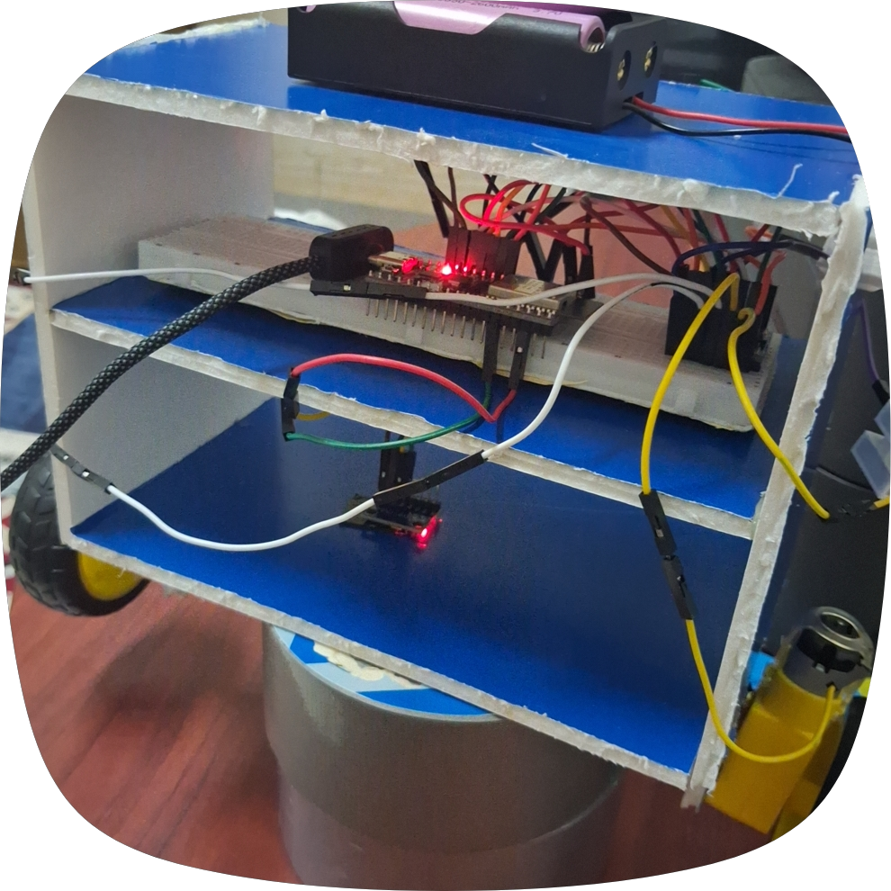
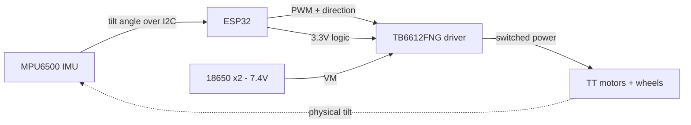
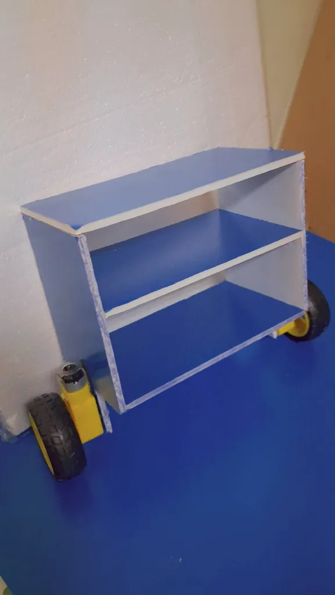
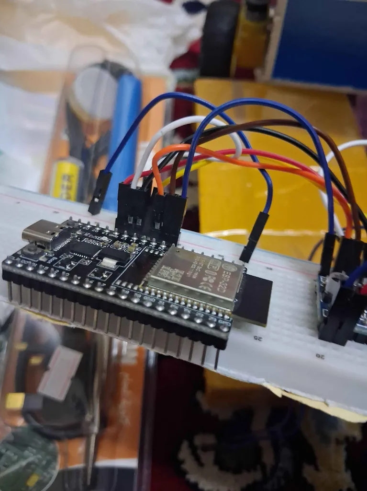
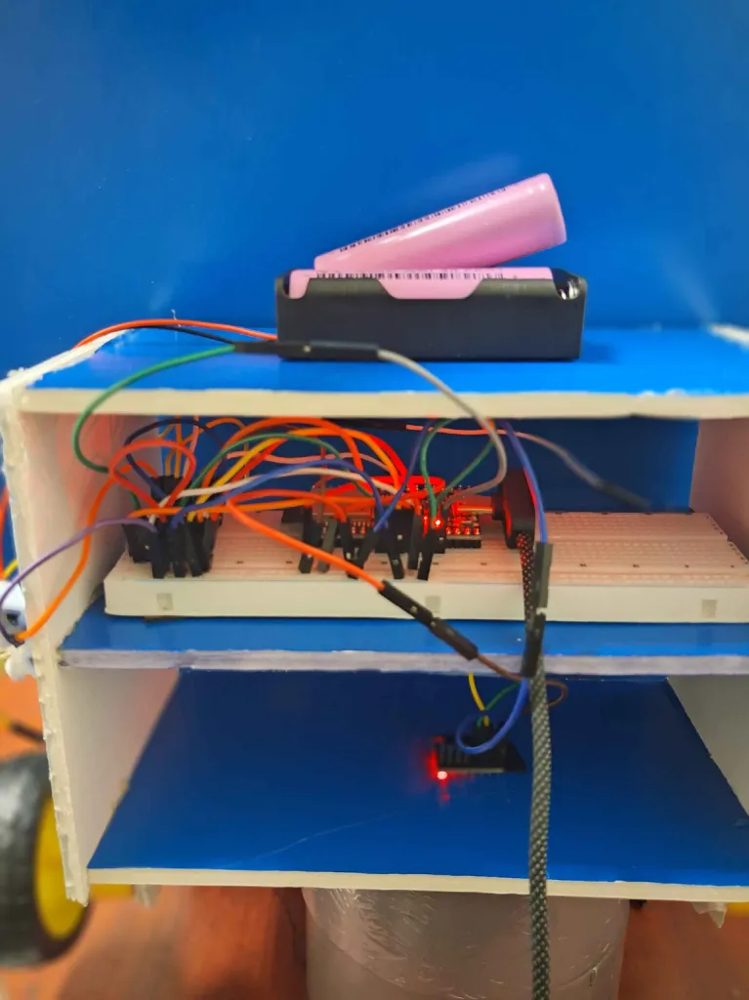
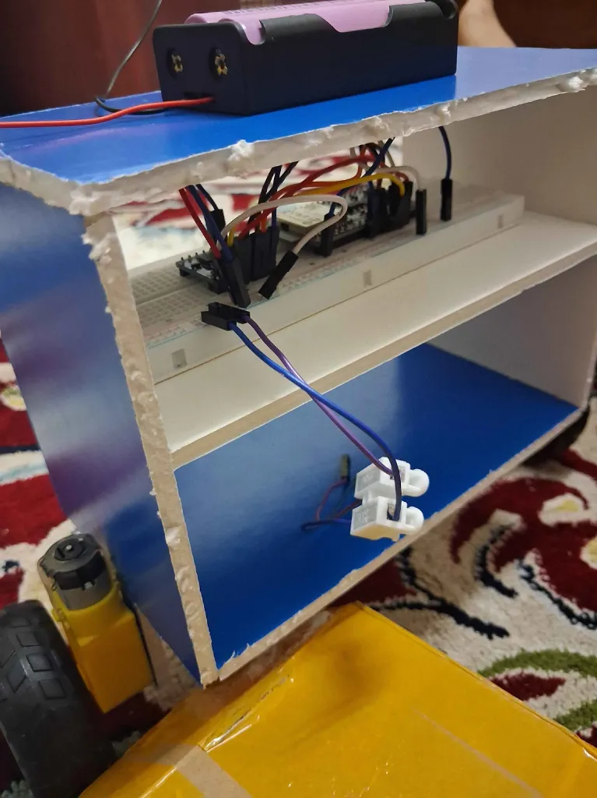

# Tobble 🤖

A self-balancing two-wheeled robot built on an ESP32. It reads its own tilt with an IMU and runs a PID loop to drive its wheels back under itself before it falls.


**This project is archived.** The control system works end to end and I've verified it on the actual robot, but I never got the PID gains tuned well enough for it to hold its balance on its own, and I've run out of time to keep going. The [Results](#results) section below has the honest breakdown of what works and what doesn't.



📹 [Demo clip](media/demo.mp4) - just a hand tilt, not the robot balancing. Shows the wheels reacting the right way when you tip it.

---

## Why I built this

My first hardware project, done alongside my MSc in AI & Robotics. Everything I'd done in the degree so far was in simulation, and I wanted to actually feel what it's like when the physics gets messy and the parts don't behave the way the datasheet says.

A self-balancing robot is an inverted pendulum: left alone it falls over, and staying upright means running a sense-think-act loop fast enough and correctly enough, over and over:

1. Read the body's tilt angle from an IMU
2. Turn that into a motor command with a PID controller
3. Drive both wheels to catch the fall and swing back toward vertical

Turned out almost none of the difficulty was in the algorithm. It was all in the hardware. The [build log](docs/BUILD_LOG.md) is the dated, in-order account of that, warts included.

---

## How it works

### Sensing the tilt
The IMU gives two different, both-flawed readings of tilt. The accelerometer is accurate on average but jittery, and it can't tell the difference between gravity and the robot accelerating on its own. The gyroscope is smooth moment to moment but drifts over time. I combine them with a complementary filter:

```
angle = α · (angle + gyro_rate · dt) + (1 − α) · accel_angle     // α = 0.98
```

At 0.98, the gyro does almost all the work second to second, and the accelerometer's small 2% share is just there to pull it back if it drifts. On the real board you can watch this happen: the gyro reacts to fast motion instantly, and the accelerometer slowly tugs it back into line. Measured gyro bias sitting still was about 0.9°/s, which doesn't sound like much until you realize it'd drift the angle by nearly a degree a second if left uncorrected.

One thing that cost me a lot of time: the IMU is mounted vertically on the standing body, not flat like it would be on a table. That means the axis that actually carries forward/back tilt isn't the one you'd assume from a textbook diagram - it's a different pair of accelerometer axes and a different gyro axis. Upright was reading close to -176° for a while (the angle math was wrapping around at ±180 and jumping all over the place) until I actually logged the raw axis values with the IMU held in different positions and worked out which ones moved.

### The control loop
A PID controller takes the error between where the robot is and upright, and turns it into a motor command:

```
output = Kp·error + Ki·errorSum + Kd·dError        // clamped to the motor range
```

Where it landed: Kp = 60, Ki = 0, Kd = 0.8. Not a converged, well-tuned result, just the last checkpoint before I ran out of time.

Kp started at 25. On real hardware that was too weak - a small 3° lean barely produced any correction, so the robot kept tipping until the lean was big, and then the response would spike and overshoot. Pushing Kp up to 60 got it reacting sooner to small errors, which is the right direction, just not far enough along.

Kd is still at its starting value. Raising it alongside Kp to actually damp the overshoot was the obvious next step, and it's the step I didn't get to.

Ki stayed at zero the whole time, on purpose. It's meant to correct for a steady, unchanging lean, but you only want to turn it on once P and D are already stable, and it needs an anti-windup clamp or it'll overshoot badly on recovery. The clamp's already in the code, waiting.

There's also a hard cutoff at ±45° that kills the motors once the robot's actually toppled, and a PWM ceiling I raised from 180 to 220 once I confirmed the wheels were free-spinning rather than stalling at that level.

### Layout

```mermaid
flowchart LR
    IMU[MPU6500 IMU] -->|tilt angle over I2C| ESP[ESP32]
    ESP -->|PWM + direction| DRV[TB6612FNG driver]
    DRV -->|switched power| M[TT motors + wheels]
    M -.->|physical tilt| IMU
    BAT[18650 x2 - 7.4V] -->|VM| DRV
    ESP -->|3.3V logic| DRV
```

---

## Hardware

| Component | Part | Role |
|---|---|---|
| Microcontroller | ESP32-32D DevKit V1 | Runs the control loop |
| IMU | GY-521 module - actually reports `WHO_AM_I = 0x70`, so it's an MPU6500, not the MPU6050 it's sold as | Tilt sensing |
| Motor driver | TB6612FNG (a "HW-048" clone board) | Drives the two motors |
| Motors + wheels | 2x TT gear motors with wheels, from a 2WD kit | Actuation |
| Chassis | Hand-built, roughly cardboard-and-foamboard - battery on top, electronics in the middle, motors at the base | Body |
| Power | 2x 18650 Li-ion cells in series, 7.4V | Runs the motors and the board |
| Prototyping | Breadboard, jumper wires, a multimeter | Wiring and, mostly, debugging |
| Cable | USB-A to USB-C | Programming the ESP32 |



The body before any electronics went in. Motors and wheels at the base, everything else stacks on top of them - that's the layout an inverted pendulum needs.

---

## Wiring



| From | To | Notes |
|---|---|---|
| IMU VCC | 3V3 | |
| IMU GND | GND (common) | |
| IMU SDA | GPIO 21 | I2C data |
| IMU SCL | GPIO 22 | I2C clock |
| TB6612 PWMA | GPIO 25 | motor A speed |
| TB6612 AIN1 / AIN2 | GPIO 26 / GPIO 27 | motor A direction |
| TB6612 PWMB | GPIO 14 | motor B speed |
| TB6612 BIN1 / BIN2 | GPIO 32 / GPIO 13 | motor B direction |
| TB6612 AO1/AO2, BO1/BO2 | the two motors | outputs |
| TB6612 VM | Battery + (7.4V) | motor power, kept off the ESP32 entirely |
| TB6612 VCC | 3V3 | driver logic power |
| TB6612 STBY | 3V3 | has to be held HIGH or the driver just sits there doing nothing |
| All grounds | tied together | ESP32, driver, and battery negative all share one ground |

Almost every hardware bug I hit traced back to this table somewhere: a dead battery holder that looked fine until it was under load, a couple of dead breadboard holes that were quietly starving the IMU of power, and a channel-B pin that got wired to the wrong GPIO so one motor would only ever spin in one direction. The [build log](docs/BUILD_LOG.md) has the multimeter readings for each one.




---

## Software

### Requirements
- [PlatformIO](https://platformio.org/install/ide?install=vscode) (VS Code extension)
- On Windows, the Silicon Labs [CP210x driver](https://www.silabs.com/software-and-tools/usb-to-uart-bridge-vcp-drivers) - without it the board never shows up as a COM port
- No IMU library needed. The Adafruit MPU6050 library refuses to talk to this chip (it checks a register and doesn't recognize it), so the code reads the sensor registers directly.

### Setup
```bash
git clone https://github.com/Intechgent/esp32-self-balancing-robot.git
# open the folder in VS Code - PlatformIO will pick up platformio.ini automatically
# Build, then Upload (close the Serial Monitor first or the upload will fail), then open the Serial Monitor at 115200 baud
```
The actual firmware is [`src/main.cpp`](src/main.cpp). Board settings are in [`platformio.ini`](platformio.ini).

### Simulation
Before I had the parts in hand I built the control loop in [Wokwi](https://wokwi.com) first. That's frozen in `simulation/` now - it doesn't model any real physics or motor behaviour, so its gains never meant anything beyond the sim. Real tuning only started once there was a physical robot to test on.

---

## Build log

The dated, honest version of all of this: what broke, what I tried, what actually fixed it. It's not a highlight reel - it includes the dead ends.

📓 [Read it here](docs/BUILD_LOG.md)

---

## Results

**What actually works, confirmed on the real robot:**

The sensor fusion holds a stable angle - steady when it's not moving, tracks a real tilt, and the gyro drift is small enough that it doesn't matter over the timescales this loop runs at. The full loop runs on hardware: tilt the body and the motor command responds correctly, scaling with how far it's tipped, cutting off past 45°, and both motors turn the right way together. I checked all of that separately with a plain motor test before trusting the full loop's behaviour.

Along the way I found and fixed a handful of real, physical faults using a multimeter: a battery holder that had failed internally, breadboard contacts that had gone bad and were quietly under-powering the IMU, a motor wired to the wrong control pins, and an angle formula that assumed the wrong mounting orientation.

**What doesn't work: it doesn't balance.**

At Kp=25 it reacted too slowly to small tilts and just fell. Kp=60 got it reacting sooner, but it now overcorrects instead of settling, and I didn't have time for another round of tuning to fix that. That's genuinely just an iteration problem, not a mystery - PID tuning by hand is trial and error, each attempt needs a live test, and I ran out of runway before it converged.

I think the honest way to put it is: the hard part - building a working sense-think-act loop across a sensor, a filter, a controller, and real motors, and getting every layer of that to actually agree with each other on real hardware - is done. What's missing is the last stretch of iteration to make the numbers converge, which needed time I didn't have left.

The [demo clip](media/demo.mp4) up top shows the loop reacting to a tilt - not balancing, just proof the whole chain responds correctly.

---

## What I'd do next, if I picked this back up

- Keep tuning Kp and Kd until it actually holds itself upright, and probably add a minimum PWM floor since these gear motors don't respond at all below a certain command
- Drive it over WiFi or Bluetooth once it can balance on its own
- Use the ultrasonic sensor on the chassis for basic obstacle avoidance
- Use the wheel encoders to hold position, not just angle
- Eventually replace the hand-tuned PID with something learned in simulation and transferred over - that's the direction I'm actually most interested in

---

## Repository structure

```
esp32-self-balancing-robot/
├── README.md
├── platformio.ini        # board config
├── src/main.cpp          # the live firmware
├── simulation/           # the old Wokwi prototype, frozen
├── docs/BUILD_LOG.md     # the full dated log
├── media/                # photos and the demo clip
└── LICENSE
```

---

## A note on the AI assistant

I used an AI assistant throughout this build, mostly as a rubber duck and a second pair of eyes: explaining concepts like sensor fusion and PID when I got stuck, reviewing code, and helping me reason through hardware faults with a multimeter in hand. Every decision here is mine, and the build log is written in my own words because the point of documenting this was to prove to myself I actually understood it, not just that it happened to work.

## License

MIT - see [LICENSE](LICENSE).
